# ygo-service — System Design

gRPC service for the SKC (Salty Card Collection) Yu-Gi-Oh! platform. It exposes
read-only card, product, restriction, and score data backed by a MySQL database.

- **Transport:** gRPC over TLS, port `9020`
- **Proto contracts:** defined in the shared `github.com/ygo-skc/skc-go/common/v3` module
  (`ygo` and `health` packages) and *implemented* here
- **Datastore:** MySQL (`go-sql-driver/mysql`), pooled connection (`skcDBConn`)
- **Registered services:** `HealthService`, `CardService`, `ProductService`,
  `CardRestrictionService`, `ScoreService` — **17 RPCs total**

---

## 1. High-level architecture

Every request follows the same three-layer path. The gRPC handlers in `api/` are thin
adapters; the repositories in `db/` own all SQL and domain logic.

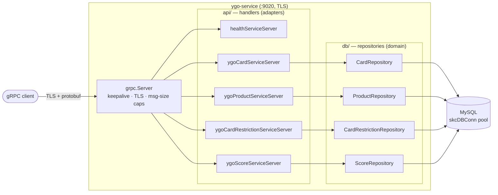

### Registration & lifecycle (`main.go` → `api/server.go`)

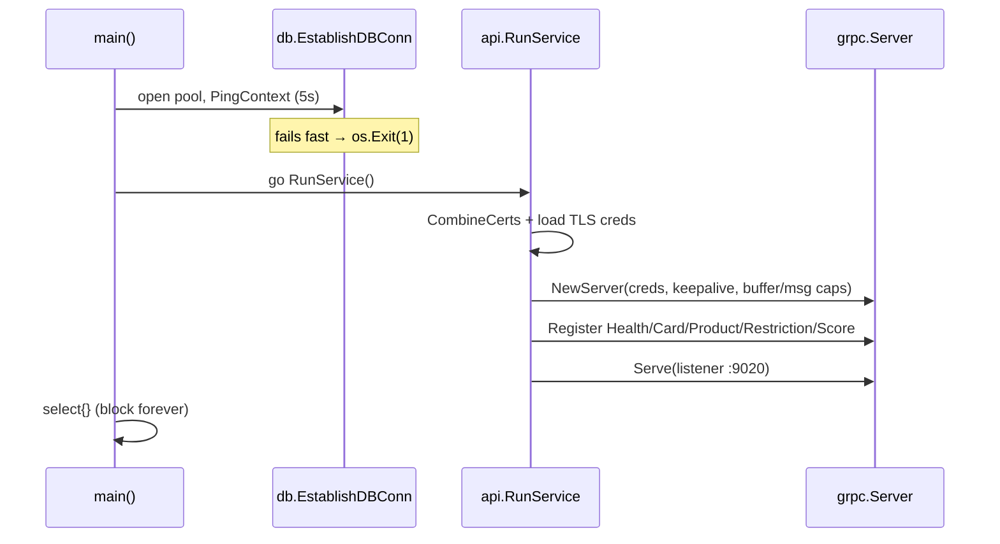

---

## 2. Cross-cutting patterns

These repeat across nearly every RPC, so they are described once here and referenced
by the per-RPC diagrams below.

| Concern | Where | Behavior |
|---|---|---|
| **Named logger** | `util.NewLogger(ctx, "<label>")` | Each handler derives a request-scoped logger + context; repos retrieve it via `util.RetrieveLogger(ctx)`. |
| **Error mapping** | `db/sql_helpers.go` | `sql.ErrNoRows` → `codes.NotFound`; any other query/scan error → `codes.Internal` ("Error occurred while querying DB"). |
| **Variadic `IN (...)`** | `buildVariableQuerySubjects` + `variablePlaceholders` | Builds `?, ?, ?` placeholders and args for multi-key lookups; empty input short-circuits to an empty result (no DB hit). |
| **Missing-key reporting** | `model.FindMissingKeys` | Batch lookups return `UnknownResources` — the subset of requested IDs/names not found — instead of erroring. |
| **Card row → proto** | `model.NewYGOCardProtoBuilder(...)` | Shared builder maps 8 card columns into a `ygo.Card`. |

**Standard batch-lookup flow** (referenced as *"batch pattern"* below):

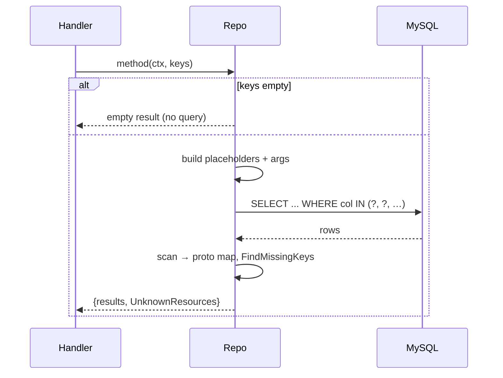

---

## 3. HealthService

### 3.1 `APIStatus`
`api/status_handler.go` — liveness/version probe. No datastore access.

- **Request/Response:** `health.APIStatusRequest` → `health.APIStatusResponse{Version: "3.0.0"}`

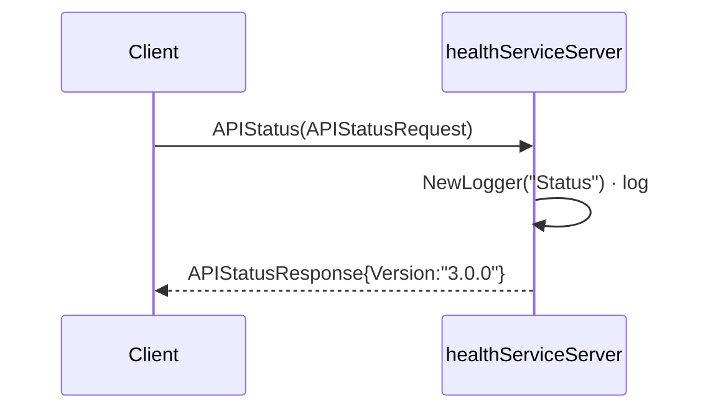

---

## 4. CardService — `api/card_service_handler.go` → `db/card_repo.go`

Nine RPCs over the `card_info` / `card_colors` tables. All share the `cardAttributes`
column set and the `parseCardRows` scanner.

### 4.1 `GetCardColors`
List of every card color and its numeric id.

- **Types:** `GetCardColorsRequest` → `GetCardColorsResponse{Values: map[color]id}`
- **SQL:** `SELECT color_id, card_color FROM card_colors ORDER BY color_id`

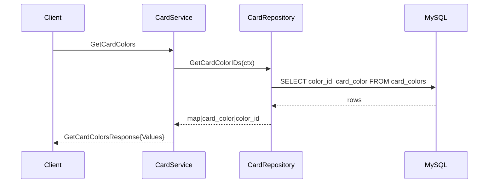

### 4.2 `GetCardByID`
Single card by card number.

- **Types:** `GetCardByIDRequest{Subject.Id}` → `GetCardByIDResponse{Card}`
- **SQL:** `SELECT <cardAttributes> FROM card_info WHERE card_number = ?`
- **Rules:** `NotFound` logged specifically when the id doesn't exist.

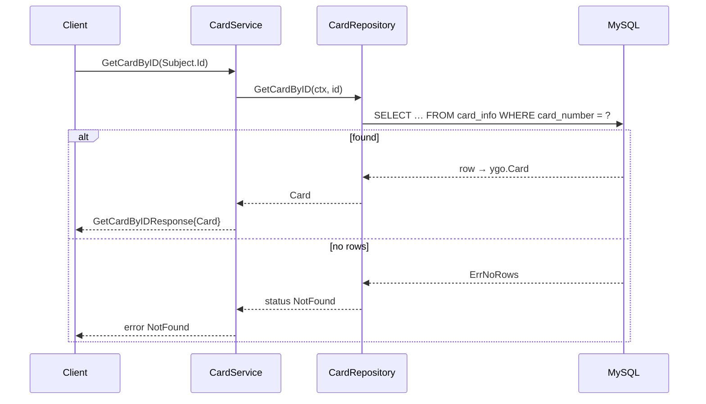

### 4.3 `GetCardsByID`  *(batch pattern)*
Multiple cards keyed by id.

- **Types:** `GetCardsByIDRequest{Subjects.Ids}` → `GetCardsByIDResponse{Cards}`
- **SQL:** `SELECT <cardAttributes> FROM card_info WHERE card_number IN (?, …)`
- **Result:** `Cards.CardInfo` keyed by id + `UnknownResources` for missing ids.

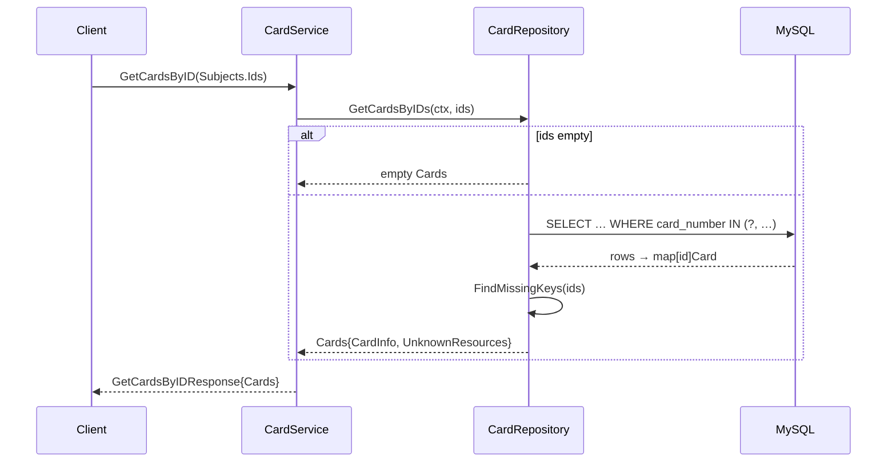

### 4.4 `GetCardsByName`  *(batch pattern)*
Same as 4.3 but keyed by exact card name.

- **Types:** `GetCardsByNameRequest{Subjects.Names}` → `GetCardsByNameResponse{Cards}`
- **SQL:** `SELECT <cardAttributes> FROM card_info WHERE card_name IN (?, …)`
- **Result:** map keyed by name (`collectWithMapUsingNameKey`) + `UnknownResources`.

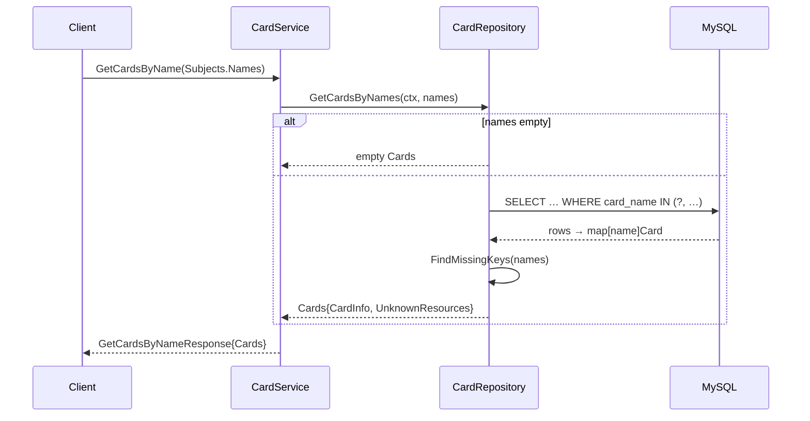

### 4.5 `GetCardsReferencingNameInEffect`
Full-text search: which cards mention the given name(s) in their effect text.

- **Types:** `GetCardsReferencingNameInEffectRequest{Subjects.Names}` → `…Response{Cards}` (list)
- **Rules:** each name is quote-stripped and wrapped as a `"phrase"` (`convertToFullText`),
  joined with spaces, then matched against a `FULLTEXT` index.
- **SQL:** `… WHERE MATCH(card_effect) AGAINST(? IN BOOLEAN MODE) ORDER BY color_id, card_name`

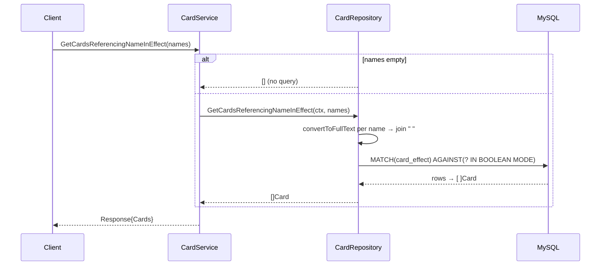

### 4.6 `GetArchetypalCardsUsingCardName`
Loose name match — cards whose **name** contains the archetype string.

- **Types:** `…Request{Subject.Name}` → `…Response{Cards}` (list)
- **SQL:** `… WHERE card_name LIKE BINARY ? ORDER BY card_name` with `%name%`.

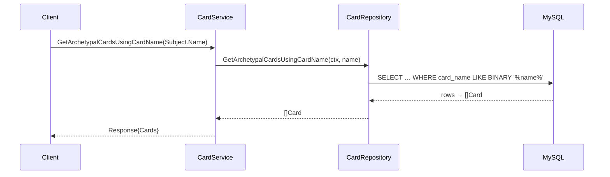

### 4.7 `GetExplicitArchetypalInclusions`
Cards **explicitly declared** part of an archetype by their effect text.

- **Types:** `…Request{Subject.Name}` → `…Response{Cards}` (list)
- **SQL (nested):** an inner full-text query (`+"This card is always treated as" +"<name>"`)
  is wrapped by an outer `REGEXP 'always treated as a.*"<name>".* card'` filter.

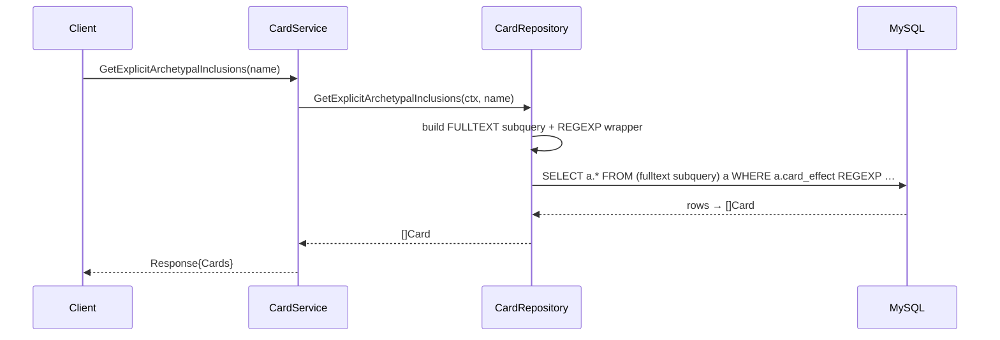

### 4.8 `GetExplicitArchetypalExclusions`
Mirror of 4.7 for cards explicitly **excluded** from an archetype.

- **Types:** `…Request{Subject.Name}` → `…Response{Cards}` (list)
- **SQL (nested):** inner `+"This card is not treated as" +"<name>"` full-text,
  outer `REGEXP 'not treated as.*"<name>".* card'`.

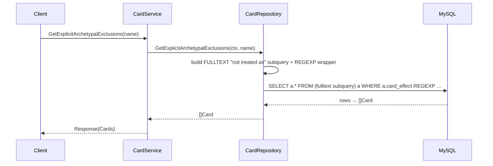

### 4.9 `GetRandomCard`
One random non-Token card, optionally excluding a blacklist.

- **Types:** `GetRandomCardRequest{Blacklist.BlackListedRefs}` → `…Response{Card}`
- **Rules:** query variant chosen by blacklist size; always `card_color != 'Token'`,
  `ORDER BY RAND() LIMIT 1`.

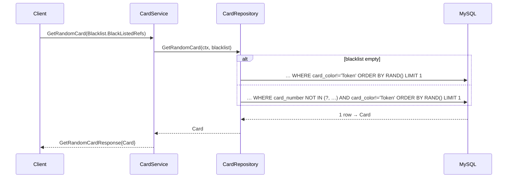

---

## 5. ProductService — `api/product_service_handler.go` → `db/product_repo.go`

Four RPCs over `products` / `product_contents` / `product_info`.

### 5.1 `GetCardsByProductID`
Full product detail: metadata + every card in the set, with rarities and a rarity histogram.

- **Types:** `…Request{Subject.Id}` → `…Response{Product}`
- **Flow:** two queries — product header, then contents — merged in `parseRowsForProductItems`,
  which folds duplicate (card, position) rows into one item with multiple rarities and
  accumulates a `RarityDistribution`.
- **SQL:**
  - `SELECT … FROM products WHERE product_id = ?`
  - `SELECT <cardAttributes>, product_position, card_rarity FROM product_contents WHERE product_id = ? ORDER BY product_position`

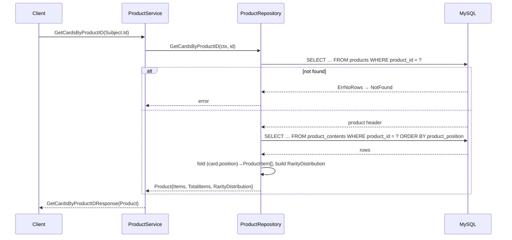

### 5.2 `GetProductSummaryByID`
Single product summary. Implemented as a thin wrapper over the batch call (5.3).

- **Types:** `…Request{Subject.Id}` → `…Response{ProductSummary}`
- **Rules:** delegates to `GetProductsSummaryByID([id])`; missing id → `codes.NotFound`.

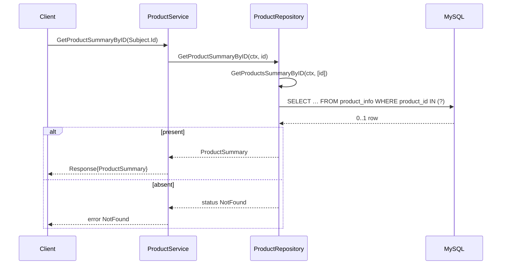

### 5.3 `GetProductsSummaryByID`  *(batch pattern)*
Multiple product summaries by id.

- **Types:** `…Request{Subjects.Ids}` → `…Response{Products}`
- **SQL:** `SELECT product_id, …, product_content_total FROM product_info WHERE product_id IN (?, …)`
- **Result:** `Products.Products` map + `UnknownResources`.

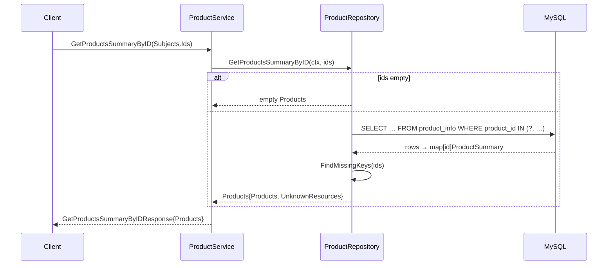

### 5.4 `GetProductsReleasedSameDay`
"On this day" — products sharing a given month/day (any year).

- **Types:** `…Request{Date string}` → `…Response{Products}` (list)
- **Rules:** handler parses `Date` as `2006-01-02`; bad format → `codes.InvalidArgument`.
  Only month/day are matched (`DATE_FORMAT(release_date,'%m-%d')`), newest year first.
- **SQL:** `… FROM product_info WHERE DATE_FORMAT(product_release_date,'%m-%d') = ? ORDER BY product_release_date DESC`

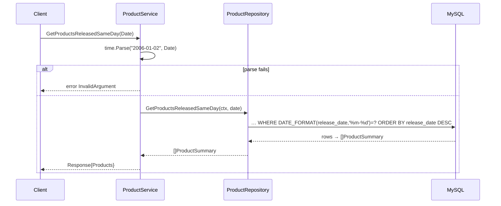

---

## 6. CardRestrictionService — `api/card_restriction_service_handler.go` → `db/card_restriction_repo.go`

### 6.1 `GetEffectiveTimelineForFormat`
Given a format, return all restriction-list effective dates split into the currently
**active** date and any **future** (scheduled) dates.

- **Types:** `ygo.Format{Value}` → `ygo.EffectiveTimeline{AllDates, FutureDates, ActiveDate}`
- **Rules (in handler):**
  - Only `Genesys` is supported (case-insensitive); otherwise `codes.InvalidArgument`.
  - "Today" is computed in **America/Chicago** (`chicagoLocation`, loaded at init).
  - Dates are returned newest-first from SQL; the handler walks them, collecting dates
    `> today` as future, then takes the **first** date `<= today` as active and stops.
- **SQL:** `SELECT UNIQUE effective_date FROM card_scores WHERE format = ? ORDER BY effective_date DESC`

```mermaid
sequenceDiagram
    participant Client
    participant H as CardRestrictionService
    participant R as CardRestrictionRepository
    participant DB as MySQL
    Client->>H: GetEffectiveTimelineForFormat(Format.Value)
    alt format != "Genesys"
        H-->>Client: error InvalidArgument
    else
        H->>R: GetDatesForFormat(ctx, format)
        R->>DB: SELECT UNIQUE effective_date FROM card_scores WHERE format=? ORDER BY effective_date DESC
        DB-->>R: []date (desc)
        R-->>H: []date
        H->>H: today = now(Chicago)
        loop each date (newest→oldest)
            alt date > today
                H->>H: append to FutureDates
            else
                H->>H: ActiveDate = date; break
            end
        end
        H-->>Client: EffectiveTimeline{AllDates, FutureDates, ActiveDate}
    end
```

---

## 7. ScoreService — `api/score_service_handler.go` → `db/score_repo.go`

Three RPCs over `card_scores` (joined to `card_info` / `cards`). The two per-card
endpoints share a `parser` fold (in the handler) that reshapes flat score rows into a
per-format current/scheduled/history view.

### 7.1 `GetScoresByFormatAndDate`
Every scored card for a format at a specific effective date, with a sort option.

- **Types:** `ygo.RestrictedContentRequest{Format, EffectiveDate, SortOrder}` → `ygo.ScoresForFormatAndDate`
- **Rules:** repo chooses an `ORDER BY` from `SortOrder`
  (`score DESC, card_color, card_name` vs. default `card_color, card_name`).
  Handler returns `codes.NotFound` when the format/date pair yields zero entries.
- **SQL:** `… FROM card_scores cs FORCE INDEX(FORMAT) JOIN card_info ci … WHERE cs.format=? AND cs.effective_date=? ORDER BY <sort>`

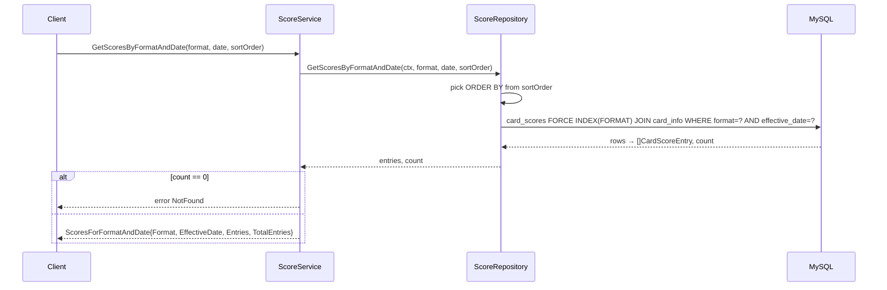

### 7.2 `GetCardScoreByID`
Full score history for one card across all formats/versions.

- **Types:** `ygo.ResourceID{Id}` → `ygo.CardScore`
- **Rules:** query returns one row per (format, effective_date) version via a
  `DISTINCT` version set `LEFT JOIN`ed to the card's scores (missing → `COALESCE(...,0)`).
  The handler's `parser` fold builds, per format: `CurrentScoreByFormat` (latest date
  `< today`), `UniqueFormats`, `ScheduledChanges` (dates `> today`, as `format|date`),
  and the full `ScoreHistory`. Empty history → `codes.NotFound`. "Today" is Chicago-local.
- **SQL:** version set `SELECT DISTINCT format, effective_date FROM card_scores`
  `LEFT JOIN card_scores … AND scores.card_number = ? ORDER BY effective_date DESC`

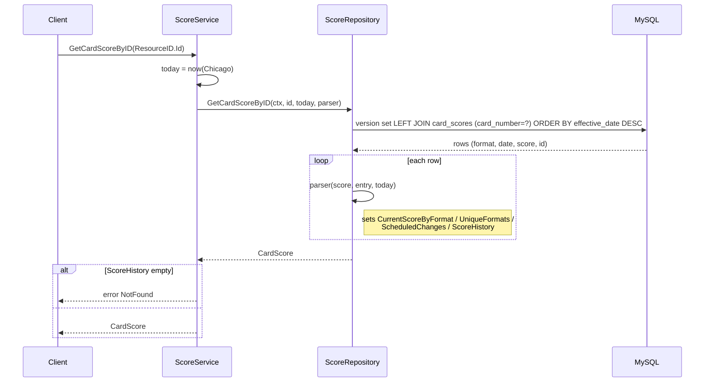

### 7.3 `GetCardScoresByIDs`  *(batch pattern)*
Score history for many cards at once.

- **Types:** `GetCardScoresByIDsRequest{Subjects.Ids}` → `…Response{Scores: CardScores}`
- **Rules:** `CROSS JOIN cards` builds the (card × version) matrix, `LEFT JOIN` fills scores
  (`COALESCE(...,0)`); the same `parser` fold runs per card id. Response wraps the per-id
  map plus `UnknownResources` (requested ids with no data).
- **SQL:** version set `CROSS JOIN cards LEFT JOIN card_scores … WHERE cards.card_number IN (?, …) ORDER BY effective_date DESC`

```mermaid
sequenceDiagram
    participant Client
    participant H as ScoreService
    participant R as ScoreRepository
    participant DB as MySQL
    Client->>H: GetCardScoresByIDs(Subjects.Ids)
    H->>H: today = now(Chicago)
    H->>R: GetCardScoresByIDs(ctx, ids, today, parser)
    alt ids empty
        R-->>H: empty map
    else
        R->>DB: version set CROSS JOIN cards LEFT JOIN card_scores WHERE cards.card_number IN (?, …)
        DB-->>R: rows
        loop each row
            R->>R: parser(scoresByID[cardID], entry, today)
        end
        R-->>H: map[id]CardScore
    end
    H->>H: FindMissingKeys(ids) → UnknownResources
    H-->>Client: Response{CardScores{CardInfo, UnknownResources}}
```

---

## 8. RPC index

| # | Service | RPC | Handler → Repo | Primary table(s) |
|---|---|---|---|---|
| 1 | Health | `APIStatus` | — | (none) |
| 2 | Card | `GetCardColors` | `GetCardColorIDs` | `card_colors` |
| 3 | Card | `GetCardByID` | `GetCardByID` | `card_info` |
| 4 | Card | `GetCardsByID` | `GetCardsByIDs` | `card_info` |
| 5 | Card | `GetCardsByName` | `GetCardsByNames` | `card_info` |
| 6 | Card | `GetCardsReferencingNameInEffect` | `GetCardsReferencingNameInEffect` | `card_info` (FULLTEXT) |
| 7 | Card | `GetArchetypalCardsUsingCardName` | `GetArchetypalCardsUsingCardName` | `card_info` |
| 8 | Card | `GetExplicitArchetypalInclusions` | `GetExplicitArchetypalInclusions` | `card_info` (FULLTEXT+REGEXP) |
| 9 | Card | `GetExplicitArchetypalExclusions` | `GetExplicitArchetypalExclusions` | `card_info` (FULLTEXT+REGEXP) |
| 10 | Card | `GetRandomCard` | `GetRandomCard` | `card_info` |
| 11 | Product | `GetCardsByProductID` | `GetCardsByProductID` | `products`, `product_contents` |
| 12 | Product | `GetProductSummaryByID` | `GetProductSummaryByID` | `product_info` |
| 13 | Product | `GetProductsSummaryByID` | `GetProductsSummaryByID` | `product_info` |
| 14 | Product | `GetProductsReleasedSameDay` | `GetProductsReleasedSameDay` | `product_info` |
| 15 | Restriction | `GetEffectiveTimelineForFormat` | `GetDatesForFormat` | `card_scores` |
| 16 | Score | `GetScoresByFormatAndDate` | `GetScoresByFormatAndDate` | `card_scores`, `card_info` |
| 17 | Score | `GetCardScoreByID` | `GetCardScoreByID` | `card_scores` |
| 18 | Score | `GetCardScoresByIDs` | `GetCardScoresByIDs` | `card_scores`, `cards` |

> Row count is 18 because `GetProductSummaryByID` and `GetProductsSummaryByID` are
> distinct RPCs sharing one repo query — **17 distinct RPCs** across 5 services.
